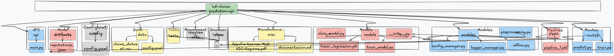

# Configuration - Documentation

This document provides detailed information about the configuration settings and directory structure used in the HDI Claims Prediction API.

---

---

## Table of Contents

- [Introduction](#introduction)
- [Configurations](#configurations)
  - [Logger Configuration](#logger-configuration)
  - [Model Configuration](#model-configuration)
  - [Pipeline Configuration](#pipeline-configuration)
  - [API Host Configuration](#api-host-configuration)
- [Directory Structure](#directory-structure)
  - [requirements](#requirements-requirementsrequirementstxt)
  - [test](#test-testtest_functionspy)
  - [routes](#routes-routespredictpy)
  - [pipes](#pipes-pipes)
  - [models](#models-modelslinear_regressionpkl)
  - [docs](#docs-docsmd)
  - [data](#data-data)
  - [config](#config-configconfigyaml)
  - [artifacts](#artifacts-artifactsimputationsjson)
  - [app](#app-appimputationpy)
- [Deployment Instructions](#deployment-instructions)
- [Common Issues and Troubleshooting](#common-issues-and-troubleshooting)
- [Glossary](#glossary)

---
## Introduction

Welcome to the configuration documentation for the HDI Claims Prediction API. This guide aims to provide you with all the necessary information to configure and understand the layout of the project.

---

## Configurations 


### Logger Configuration

The logging configuration specifies where and how logs should be stored and rotated. You can find the configuration in the `config/config.yaml` file.

#### Configuration

```yaml
logger:
  log_file: "logs/logger.log"
  csv_file: "logs/logger.csv"
  level: "INFO"
  max_bytes: 10485760
  backup_count: 5
```

- **Log File:** Path where the log file will be stored.
- **CSV File:** Path where the CSV log file will be stored.
- **Log Level:** Logging level to control the verbosity.
- **Max Bytes:** Maximum size (in bytes) for each log file before it gets rotated.
- **Backup Count:** Number of backup log files to keep.

#### Example `modules/logger_manager.yaml`

```python
import logging
import logging.handlers

logger = logging.getLogger()
logger.setLevel(logging.INFO)

handler = logging.handlers.RotatingFileHandler(
    'logs/logger.log', maxBytes=10485760, backupCount=5
)
logger.addHandler(handler)
```

---

### Model Configuration

The model path specifies where the trained model is stored. `config/config.yaml`

#### Configuration

```yaml
models:
  model_path: "models/linear_regression.pkl"
```

- **Model Path:** Path where the machine learning model file is stored.

#### Example `modules/mlflow.py`

Load the model in Python:

```python
import joblib

def load_model(cfg):
    """Carga el modelo preentrenado basado en la configuración de Hydra.

    Args:
        cfg (DictConfig): Configuración cargada por Hydra.

    Returns:
        joblib(pkl): Modelo cargado.
    """
    logger = get_logger()

    model_path = cfg.models.model_path
    abs_model_path = os.path.join(root_dir, model_path)

    logger.info(f"Cargando el modelo desde: {model_path}")

    return joblib.load(abs_model_path)

```

---

### Pipeline Configuration

The pipeline configuration outlines the steps involved in the preprocessing pipeline.

#### Configuration `config/config.yaml`

```yaml
pipeline:
  imputation_path: "artifacts/imputations.json"
  steps:
    - name: "Step 1"
      pipeline: "pipes/pipeline_1.pkl"
    - name: "Step 2"
      pipeline: "pipes/pipeline_2.pkl"
    - name: "Step 3"
      pipeline: "pipes/pipeline_3.pkl"
    - name: "Step 4"
      pipeline: "pipes/pipeline_4.pkl"
    - name: "Step 5"
      pipeline: "pipes/pipeline_5.pkl"
```

- **Imputation Path:** Path where the imputation details are stored.
- **Steps:** Sequence of steps in the preprocessing pipeline.

#### Example Usage  `modules/preprocessing.py`

Loading and using the pipeline:

```python
# pipeline steps
for step in cfg.pipeline.steps:
    logger.info(f"Ejecutando {step.name} con pipeline: {step.pipeline}")
    df = pipeline_run(df, step.pipeline)

# Cargar el pipeline
logger.info(f"Cargando el pipeline: {abs_pipeline_file}")
with open(abs_pipeline_file, 'rb') as file:
    pipeline = dill.load(file)
```

---

### API Host Configuration  `config/config.yaml`

The API server host and port settings.

#### Configuration

```yaml
api:
  host: "127.0.0.1"
  port: 8000
```

- **Host:** IP address where the API server is hosted.
- **Port:** Port number on which the API server listens.

#### Example

Running the API locally:

```bash
uvicorn main:app --host 127.0.0.1 --port 8000
```

---

## Directory Structure



Explanation of various directories and important files within the project.

### requirements `requirements/requirements.txt`

Contains the requirements files listing the dependencies for the project.

```yaml
requirements/
  ├── requirements-docs.txt    # Dependencies required for generating documentation
  ├── requirements.txt         # Core dependencies for running the project
  └── requirements_dev.txt     # Development dependencies for testing, linting, etc.
```

#### Principal File: `requirements.txt`

The `requirements.txt` file lists the core dependencies required to run the project. The dependencies include:

```plaintext
fastapi
pydantic
pandas
numpy
dill
mlflow
scikit-learn
uvicorn
hydra-core
joblib
python-dotenv
omegaconf
python-multipart
pytest
httpx
locust
coverage
```

To install these dependencies, run:

```sh
pip install -r requirements/requirements.txt
```

### test `test/test_functions.py`

Holds all the unit tests and integration tests for the project.

```yaml
test/
  └── test_functions.py             # Test cases for unit and integration tests
# 1 directories
```

#### Principal Code

The `test` folder contains test cases for unit testing and integration testing using `pytest` and `fastapi.testclient`.

##### Test File: `test_pipeline.py`

```python
import pytest
import pandas as pd
from fastapi.testclient import TestClient
from modules import full_pipeline, load_model, config_manager
from api.main import app

# Create a test client for the API
client = TestClient(app)

# Fixture to initialize and clear Hydra configuration in each test
@pytest.fixture(scope="module")
def hydra_cfg():
    from hydra.core.global_hydra import GlobalHydra
    if GlobalHydra.instance().is_initialized():
        GlobalHydra.instance().clear()
    config = config_manager.init_config()
    return config  # Ensure to return the DictConfig object

def test_full_pipeline(hydra_cfg):
    # Example data for the pipeline
    data = pd.DataFrame({
        "claim_id": [1],
        "marca_vehiculo": ["ford"],
        "antiguedad_vehiculo": [5],
        "tipo_poliza": [2],
        "taller": [1],
        "partes_a_reparar": [3],
        "partes_a_reemplazar": [1]
    })

    try:
        result = full_pipeline(data, hydra_cfg)
        assert not result.isnull().values.any(), "The pipeline should impute all null values"
        assert "log_total_piezas" in result.columns, "The 'log_total_piezas' column is missing in the pipeline result"
    except Exception as e:
        pytest.fail(f"Pipeline error: {str(e)}")

def test_load_model(hydra_cfg):
    # Test for loading the model
    try:
        model = load_model(hydra_cfg)
        assert model is not None, "The model was not loaded correctly"
    except Exception as e:
        pytest.fail(f"Model loading error: {str(e)}")

def test_predict_endpoint():
    # Input data for the predict endpoint
    payload = {
        "claim_id": 1,
        "marca_vehiculo": "ford",
        "antiguedad_vehiculo": 5,
        "tipo_poliza": 2,
        "taller": 1,
        "partes_a_reparar": 3,
        "partes_a_reemplazar": 1
    }

    response = client.post("/api/v1/predict/", json=payload)
    assert response.status_code == 200, "The endpoint response should be 200 OK"
    json_data = response.json()
    assert "prediccion" in json_data, "The response should contain the 'prediccion' field"
```

### routes `routes/predict.py`

Contains the route definitions for the API endpoints. Example: `train.py`, `predict.py`.

```yaml
routes/
  ├── __init__.py              # Initialization file for Python package
  ├── predict.py               # Route for prediction endpoint
  └── train.py                 # Route for training endpoint
# 1 directories, 3 files
```

#### Principal Code: `routes/predict.py`

The `predict.py` file inside the `routes` folder contains the endpoint logic for the `/api/v1/predict/` API. It converts the incoming claim data into a dataframe, processes it through the pipeline, and predicts the outcome using the machine learning model.

##### Detailed Code of `predict.py`

```python
import pandas as pd
import time
from datetime import datetime
from fastapi import APIRouter, HTTPException, Request
from starlette.concurrency import run_in_threadpool

from models import Claim
from modules import full_pipeline, load_model, log_to_csv

router = APIRouter()

@router.post("/api/v1/predict/", include_in_schema=True)
async def predict_claim(claim: Claim, request: Request):
    cfg = request.app.state.cfg
    logger = request.app.state.logger
    start_time = time.time()

    logger.info("Solicitud recibida en /api/v1/predict/")

    # convert claim to dataframe
    data = pd.DataFrame([claim.dict()])

    # load model asynchronously
    try:
        logger.info("Cargando el modelo...")
        modelo = await run_in_threadpool(load_model, cfg)
    except Exception as e:
        logger.error(f"Error al cargar el modelo: {str(e)}")
        raise HTTPException(status_code=500, detail=f"Error al cargar el modelo: {str(e)}")

    # full pipeline asynchronously
    try:
        logger.info("Ejecutando el pipeline de transformación...")
        df_procesado = await run_in_threadpool(full_pipeline, data, cfg)
    except Exception as e:
        logger.error(f"Error en el pipeline de transformación: {str(e)}")
        raise HTTPException(status_code=500, detail=f"Error en el pipeline de transformación: {str(e)}")

    # predict asynchronously
    try:
        logger.info("Realizando la predicción...")
        if claim.tipo_poliza == 4:
            logger.info("Tipo de póliza es 4, devolviendo predicción: -1")
            prediccion = [-1]
        else:
            logger.info("Tipo de póliza no es 4, realizando predicción...")
            model_features = modelo.feature_names_in_
            df_for_prediction = df_procesado[model_features]
            prediccion = await run_in_threadpool(modelo.predict, df_for_prediction)
            logger.info(f"Predicción: {prediccion[0]}")
    except Exception as e:
        logger.error(f"Error en la predicción: {str(e)}")
        raise HTTPException(status_code=500, detail=f"Error en la predicción: {str(e)}")

    end_time = time.time()
    execution_time = round(end_time - start_time, 4)

    # log to CSV
    log_data = {
        "timestamp": datetime.now().strftime("%Y-%m-%d %H:%M:%S"),
        "claim_id": claim.claim_id,
        "marca_vehiculo": claim.marca_vehiculo,
        "antiguedad_vehiculo": claim.antiguedad_vehiculo,
        "tipo_poliza": claim.tipo_poliza,
        "taller": claim.taller,
        "partes_a_reparar": claim.partes_a_reparar,
        "partes_a_reemplazar": claim.partes_a_reemplazar,
        "prediction": prediccion[0],
        "execution_time": execution_time
    }
    log_to_csv(log_data, cfg)

    logger.info(f"Predicción realizada para claim_id {claim.claim_id} en {execution_time}s")

    return {"prediccion": prediccion[0]}
```

#### Principal Code: `routes/train.py`

Logic for the machine learning model.

```python
@router.post("/api/v1/train/")
async def train(file: UploadFile = File(...)):
    try:
        # get logger from api state
        logger = request.app.state.logger
        logger.info("Solicitud recibida en /api/v1/train/")

        df = await run_in_threadpool(pd.read_csv, file.file)
        logger.info(f"Datos recibidos: {df}")

        logger.info("Iniciando el entrenamiento del modelo...")
        resultado = await run_in_threadpool(train_model, df)

        return {
            "message": "Modelo entrenado con éxito",
            "details": resultado
        }
    except Exception as e:
        logger.error(f"Error en el entrenamiento: {str(e)}")
        raise HTTPException(status_code=500, detail=f"Error en el entrenamiento: {str(e)}")
```

### pipes `pipes/*.pkl`

Stores the pre-processing pipeline files used by the model.

```yaml
pipes/
  ├── pipeline_1.pkl           # Pipeline file for step 1
  ├── pipeline_2.pkl           # Pipeline file for step 2
  ├── pipeline_3.pkl           # Pipeline file for step 3
  ├── pipeline_4.pkl           # Pipeline file for step 4
  └── pipeline_5.pkl           # Pipeline file for step 5
# 1 directory, 5 files
```

### models `models/linear_regression.pkl`

Contains the machine learning model files.

```yaml
models/
  ├── __init__.py              # Initialization file for Python package
  ├── claim_model.py           # Code for claim model
  ├── linear_regression.pkl    # Trained linear regression model
  └── train_model.py           # Code for training the model
# 1 directories, 4 files
```

### docs `docs/*.md`

Documentation-related files for the project, including Markdown files for MkDocs.

```yaml
docs/
  ├── api.md                   # API documentation
  ├── commands.md              # Command line interface documentation
  ├── configuration.md         # Configuration documentation
  ├── coverage.md              # Coverage reports
  ├── deploy.md                # Deployment guidelines
  ├── images                   # Images used in documentation
  │   ├── C1.png
  │   ├── C2.png
  │   ├── Coverag1.png
  │   ├── Coverag2.png
  │   ├── Coverag3.png
  │   ├── d1.png
  │   ├── d2.png
  │   └── d3.png
  ├── index.md                 # Index page for MkDocs
  ├── licence.md               # License information
  ├── stress_test.md           # Stress testing documentation
  └── unit_test.md             # Unit testing documentation
# 1 directories, 14 files
```

### data `data/*`

Directory for storing datasets used for training and testing the models.

```yaml
data/
  ├── claims_dataset.csv       # Dataset with claims data
  └── config.yaml              # Configuration for dataset
# 1 directory, 2 files
```

### config `config/config.yaml`

Holds configuration files, such as YAML files specifying the application settings.

```yaml
config/
  └── config.yaml              # Main application configuration file
# 1 directory, 1 file
```

### artifacts `artifacts/imputations.json`

Contains intermediate artifacts generated during model training and preprocessing, such as imputation details or temporary data.

```yaml
artifacts/
  └── imputations.json         # Imputation details
# 1 directory, 1 file
```

### app `app/imputation.py`

Main application code directory. Contains sub-directories and modules necessary for running the application.

```yaml
app/
  └── imputation.py            # Code for data imputation
# 1 directory, 1 file
```

#### Principal Code: `imputation.py`

The `imputation.py` file contains the main logic for data imputation using a custom transformer. It uses the Hydra configuration management framework to manage configurations, such as dictionary values for imputing missing data. The main components include:

- **CustomImputer Class:** A custom transformer that fills missing values with specified values.
- **Pipeline Integration:** Incorporates the `CustomImputer` and `StandardScaler` into a scikit-learn `Pipeline`.
- **DataFrame Example:** Provides an example DataFrame and applies the pipeline to this DataFrame, demonstrating how missing values are imputed and data is scaled.

Example usage:

```python
import hydra
from omegaconf import DictConfig, OmegaConf
import pandas as pd
import numpy as np
from sklearn.base import TransformerMixin
from sklearn.pipeline import Pipeline
from sklearn.preprocessing import StandardScaler

class CustomImputer(TransformerMixin):
    def __init__(self, fill_values):
        self.fill_values = fill_values

    def fit(self, X, y=None):
        return self

    def transform(self, X):
        X = X.copy()
        for col, value in self.fill_values.items():
            X[col] = X[col].fillna(value)
        return X

@hydra.main(version_base=None, config_path="../data", config_name="config")
def main(cfg: DictConfig):
    diccionario_imputacion = cfg.diccionario_imputacion

    pipeline = Pipeline([
        ('imputer', CustomImputer(diccionario_imputacion)),
        ('scaler', StandardScaler())
    ])

    df = pd.DataFrame({
        'log_total_piezas': [np.nan, 2.3, 4.5],
        'marca_vehiculo_encoded': [1, np.nan, 3],
        'valor_vehiculo': [4500, 3000, np.nan],
        'valor_por