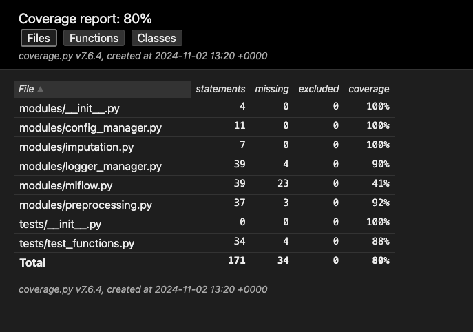
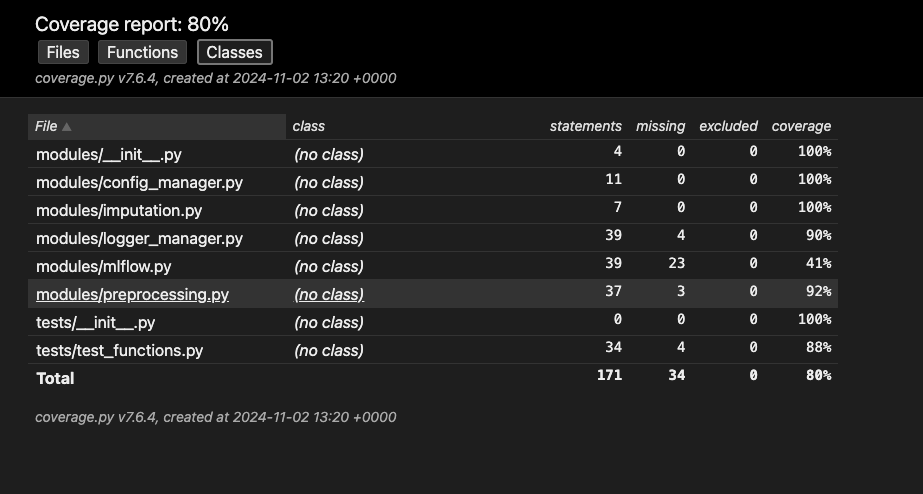
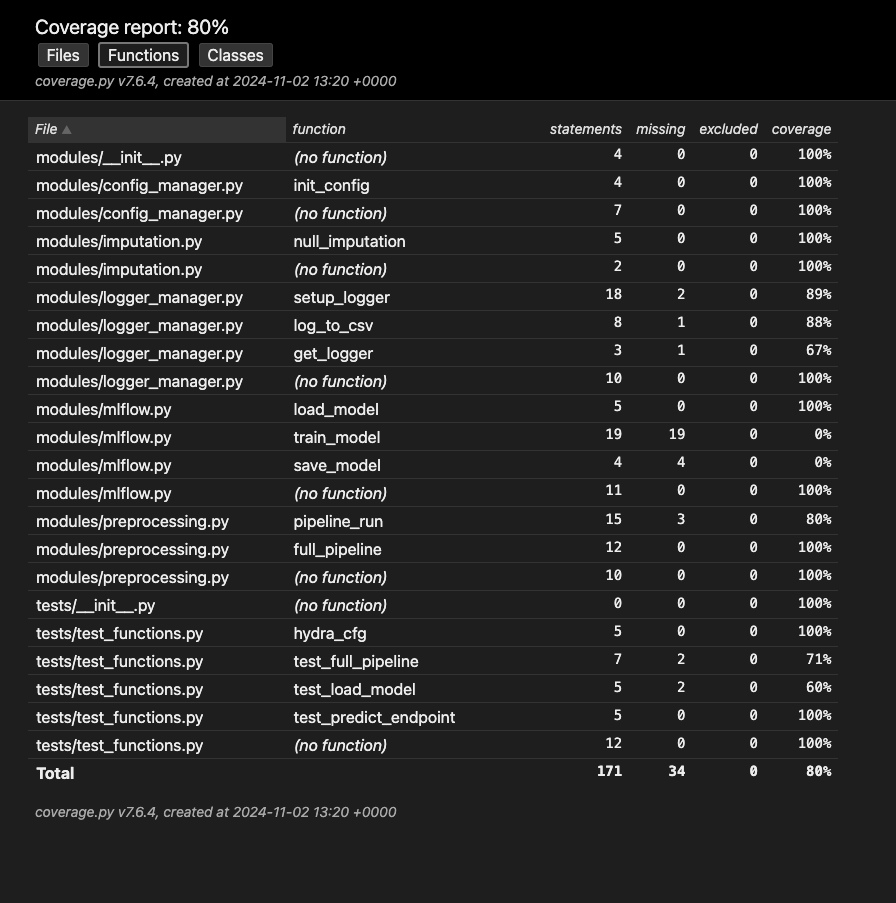

# Coverage Report Summary

This report summarizes the code coverage achieved during testing. The overall coverage is **80%**.

---

## Overview

The report was generated using `coverage.py v7.6.4` on `2024-11-02 13:20 +0000`. A total of 171 statements were analyzed, with 34 missing. No statements were excluded.

---

## Detailed Breakdown

The following tables provide a more granular view of the coverage, broken down by files, classes, and functions.

### Files

This view shows the coverage for each file in the project. Files like `modules/__init__.py`, `modules/config_manager.py`, and `modules/imputation.py` have achieved 100% coverage. However, `modules/mlflow.py` and `modules/logger_manager.py` have lower coverage, indicating areas that require more testing.

---

### Classes

This view shows the coverage by class. Since most of the files don't define classes (indicated by "(no class)"), this view doesn't provide much additional information beyond the file-level view in this specific case.

---

### Functions

This view provides the most detailed breakdown, showing the coverage for individual functions. This helps pinpoint specific functions with low coverage, such as `log_to_csv` and `get_logger` within `modules/logger_manager.py`, and `train_model` in `modules/mlflow.py`. These functions should be prioritized for further testing.

---

## Conclusion

While the overall coverage is 80%, there are areas that require improvement. Focusing testing efforts on the modules and functions identified with lower coverage will help increase the overall robustness and reliability of the codebase.
