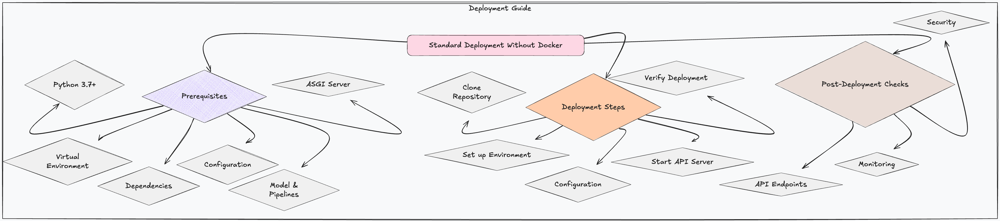

# Standard Deployment Guide

This guide provides comprehensive instructions for deploying the HDI Claims Prediction API. The API is built using FastAPI and utilizes a pre-trained Scikit-learn model. This document covers both standard deployment without Docker as well as deployment using a Docker image.

---

---


## Prerequisites

### Python 3.7+
Ensure you have Python 3.7 or a later version installed on your system.

### Virtual Environment (Recommended)
Create and activate a virtual environment to isolate your project dependencies:
```bash
python3 -m venv .venv
source .venv/bin/activate  # Activate (Linux/macOS)
.venv\Scripts\activate     # Activate (Windows)
```

### Dependencies
Install the required project dependencies using the following command:
```bash
pip install -r requirements/requirements.txt
```

### Configuration
Configure the application via the `config/config.yaml` file, which contains essential settings such as API configurations, model paths, and logging options. Set the `CONFIG_PATH` environment variable to the directory containing `config.yaml`:
```bash
# For Linux/macOS, consider adding this to your `.bashrc` or `.zshrc` for persistence
export CONFIG_PATH=config

# For Windows, use `setx` for a persistent environment variable (requires admin privileges)
set CONFIG_PATH=config
setx CONFIG_PATH config /M  # You may need to restart your terminal for changes to take effect
```

### Model and Pipelines
Ensure the following files and directories are set up in your project directory:
- **Trained Model:** `models/linear_regression.pkl`
- **Preprocessing Pipelines:** `pipes/*.pkl`
- **Imputation Dictionary:** `artifacts/imputations.json`

### ASGI Server
Use Uvicorn for development and testing or Gunicorn for production to serve the FastAPI application.

---

## Deployment Steps

### Standard Deployment (Without Docker)

1. **Clone the Repository**
   Clone the API repository to your deployment environment:
   ```bash
   git clone <repository-url>
   cd <repository-directory>
   ```

2. **Set up the Environment**
   Create and activate a virtual environment, then install dependencies:
   ```bash
   python3 -m venv .venv
   source .venv/bin/activate  # for Linux/macOS
   .venv\Scripts\activate     # for Windows
   pip install -r requirements/requirements.txt
   ```

3. **Configuration**
   Set the `CONFIG_PATH` environment variable to point to the directory containing `config.yaml`:
   ```bash
   export CONFIG_PATH=config  # Linux/macOS
   set CONFIG_PATH=config     # Windows
   ```

4. **Start the API Server**
   - **For Development/Testing (with Uvicorn and auto-reload):**
     ```bash
     uvicorn api.main:app --host 127.0.0.1 --port 8000 --reload
     ```
   - **For Production (with Gunicorn and multiple workers):**
     ```bash
     gunicorn -w 4 -k uvicorn.workers.UvicornWorker api.main:app -b 0.0.0.0:8000
     ```
     Use a process manager like Supervisor or systemd to manage Gunicorn for automatic restarts.

5. **Verify Deployment**
   Access the API root endpoint (e.g., `http://127.0.0.1:8000/` or your server IP) to ensure the API is running correctly.

---

### Docker Deployment (Recommended for Production)

1. **Create a `Dockerfile`**
   Here is an example `Dockerfile` to build a Docker image for the API:
    ```dockerfile
   FROM python:3.11-slim

   WORKDIR /app
   
   COPY . .
   
   # Upgrade and install dependencies
   RUN apt-get update && apt-get install -y --no-install-recommends \
       build-essential \
       libpq-dev \
       gcc \
       && apt-get clean && rm -rf /var/lib/apt/lists/*
   
   RUN pip install --no-cache-dir -r requirements/requirements.txt
   
   ENV HOST="0.0.0.0" \
       PORT="8000" \
       CONFIG_PATH="../config"
   
   EXPOSE ${PORT}
   
   # Run the app
   CMD ["uvicorn", "api.main:app", "--host", "${HOST}", "--port", "${PORT}"]
   ```

2. **Build the Docker Image**
   Build the Docker image using the following command:
    ```bash
    docker build -t hdi-claims-api .
    ```

3. **Run the Docker Container**
   Run the Docker container with the following command:
    ```bash
    docker run -d -p 8000:8000 hdi-claims-api
    ```

4. **Verify Deployment**
   Access the API root endpoint (e.g., `http://localhost:8000` or your server IP) to ensure the API is running correctly within the Docker container.

---

## Post-Deployment Checks (Applicable to Both Deployment Methods)

- **API Endpoints:** Thoroughly test all API endpoints to ensure they function as expected.
- **Monitoring:** Set up monitoring to track the API's performance and availability.
- **Security:** Implement security measures such as HTTPS, firewalls, and proper authentication & authorization mechanisms.