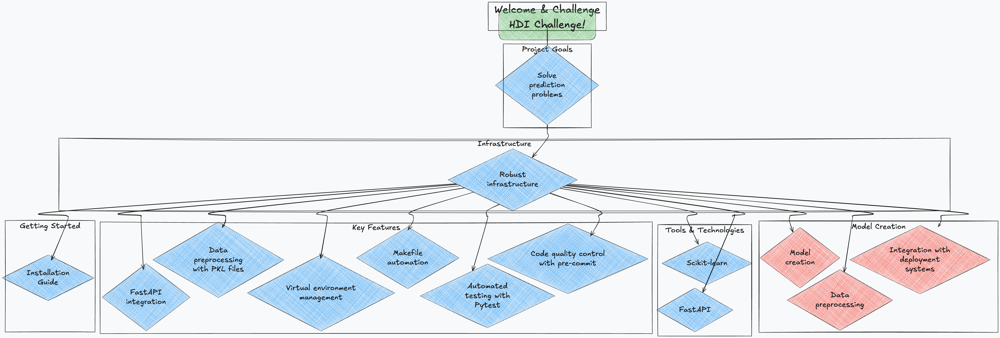

# HDI Challenge

Welcome to **HDI Challenge**! This solution is designed to tackle complex prediction and data analysis challenges in the realms of artificial intelligence and machine learning.

---
**Repository:** [https://github.com/jarb29/hdi-reto](https://github.com/jarb29/hdi-reto)

---
## What is HDI Challenge?

**HDI Challenge** is a project focused on solving prediction problems using advanced machine learning techniques. It provides a robust infrastructure for model creation, data preprocessing, and seamless integration with deployment systems.

This project is designed to simplify the development of solutions that involve massive data processing, advanced preprocessing, and the implementation of predictive models using tools such as Scikit-learn, and FastAPI.

## Key Features

- **Integration with FastAPI**: Build efficient and user-friendly APIs.
- **Robust Data Processing**: Execute preprocessing pipelines with PKL files according to project needs.
- **Virtual Environment Management**: Automatic virtual environment setup with support for Python.
- **Makefile Automation**: Manage common tasks easily using Makefile commands.
- **Automated Testing**: Initial test setup with Pytest to ensure code quality.
- **Code Quality Control**: Quality checks with pre-commit hooks to maintain project standards.

## Getting Started

To get started with **HDI Challenge**, consult our [Installation Guide](initialization.md).

## License

**HDI Challenge** is licensed under the [MIT License](license.md).

---

[Back to Top](#hdi-challenge)
