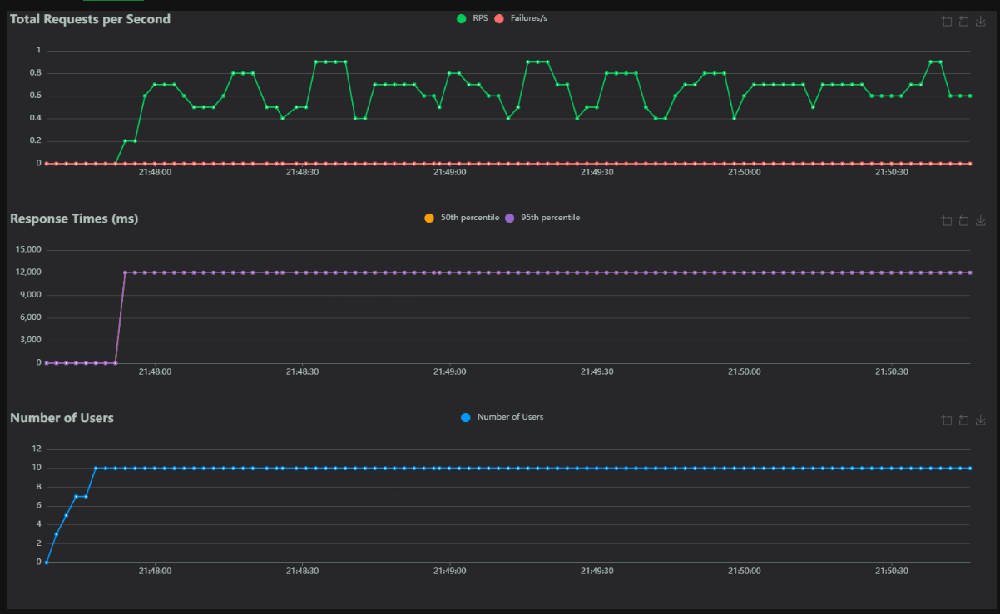
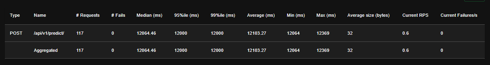

# Stress Tests

This document provides details on the stress testing strategy for the HDI Claims Prediction API, evaluating its performance and stability under high load.

---

## Tool

We use **Locust** for stress testing. Locust is an open-source load testing tool that simulates many concurrent users by defining user behavior.

---

## Test Scenarios

Stress test scenarios are defined in `tests/stress/locustfile.py`. This script simulates user behavior, such as sending requests to the `/api/v1/predict/` endpoint.

---

## Running Stress Tests

1. **Start the API Server**
    - Ensure the API server is running (e.g., `make run`).

2. **Execute Locust**
    ```bash
    make stress-tests
    ```
    - This starts Locust and opens a web interface at [http://127.0.0.1:8000](http://127.0.0.1:8089).

3. **Configure and Run**
    - In the Locust UI, set the number of users and hatch rate. Start the test to simulate traffic.

---

## Locust File (`locustfile.py`)

```python
from locust import HttpUser, TaskSet, task, between

class PredictTaskSet(TaskSet):

    @task
    def predict(self):
        # Place holder for the payload and assertions
        pass  # Replace this with the actual implementation

class PredictTestUser(HttpUser):
    tasks = [PredictTaskSet]
    wait_time = between(1, 5)
```
---

## Results and Analysis

Locust provides charts and reports on RPS, response times, and failures. Analyze these to identify bottlenecks under high load. Example results are in `tests/stress/results/results.md`.

---

# Stress Test Results Analysis

## Requests per Second (RPS)

- The "Total Requests per Second" chart shows a request rate of around 0.6 RPS. This suggests that the system is continuously managing requests, although the rate isn't very high.
- For a stress test, this could indicate slow request processing speeds, possibly due to the workload or the capacity of the model running on the endpoint.



## Response Times

- The "Response Times" chart shows high response times, with an average of around 12064 ms and a similar median, indicating most requests take over 12 seconds to process.
- The minimum recorded time is 12064 ms, while the maximum reaches 12369 ms. This suggests consistent latency, possibly due to heavy models and processing pipelines taking considerable time to complete.
- High latency could be an area for improvement since lower response times are preferable in production applications to provide an adequate user experience.



## Concurrent Users

- In the "Number of Users" chart, the number of users remains steady at 10. This was the peak number of concurrent users configured during the test, and the system was able to handle this load without response errors (failures).
- The fact that the system can support 10 users without failures is positive, but the high latency indicates it might not scale well with a much larger number of concurrent users.


## Tabular Summary

- In the results table, we observe that a total of 117 requests were made, and none failed. This is positive and shows that the endpoint is robust in handling requests without errors.
- The average response size is 32 bytes, which is low, suggesting that the response probably only contains the prediction result and no additional data.

---
